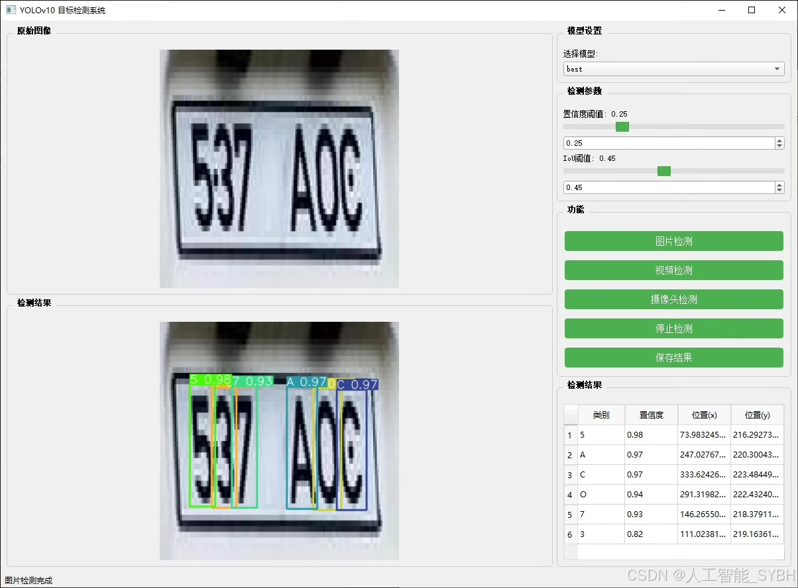
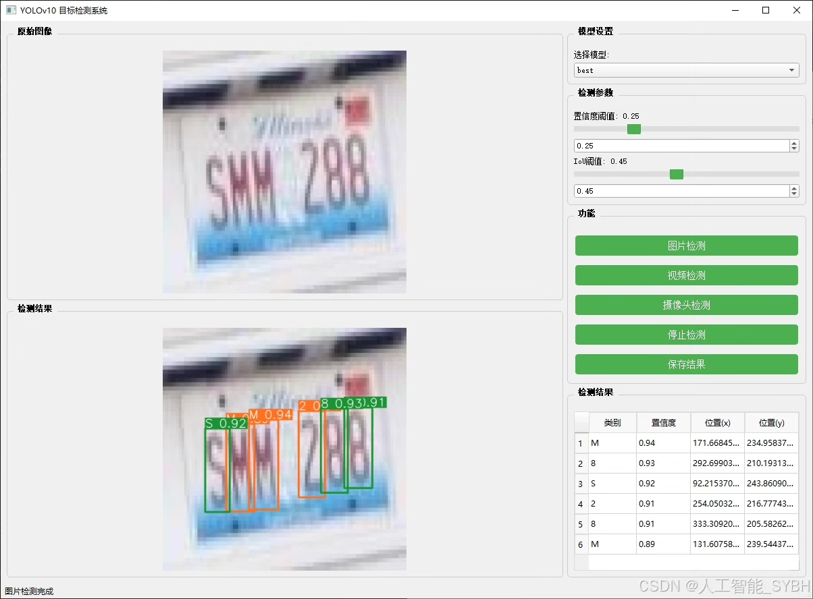
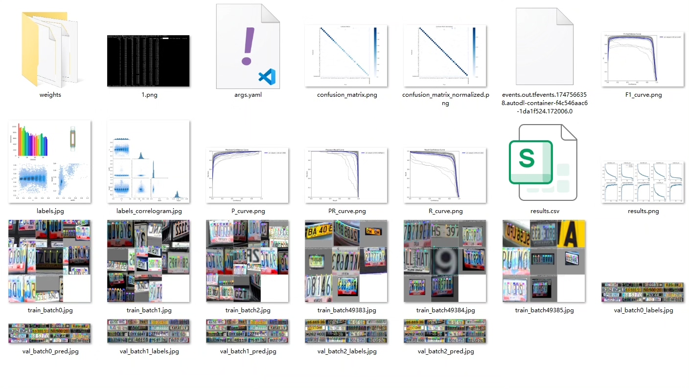
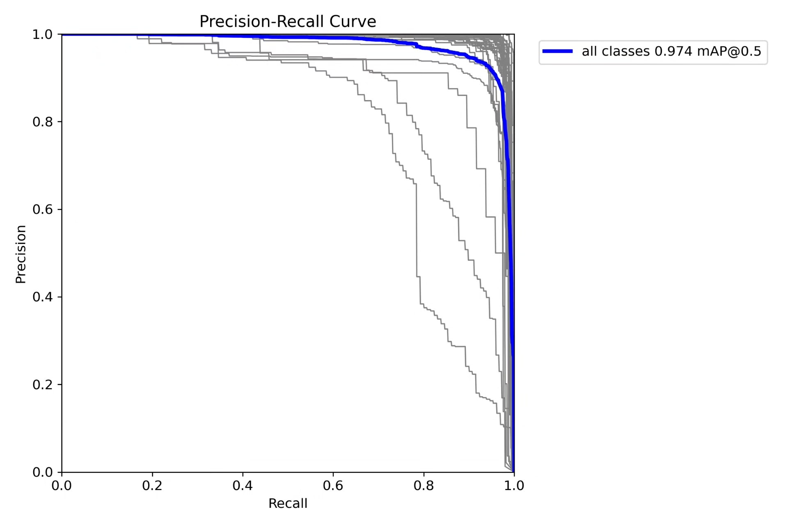
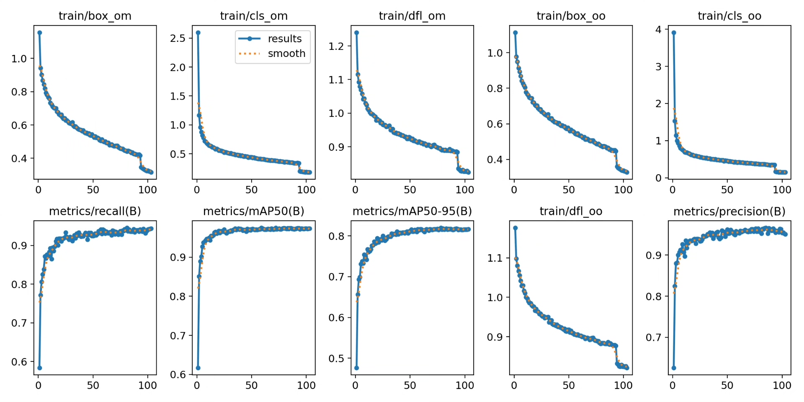
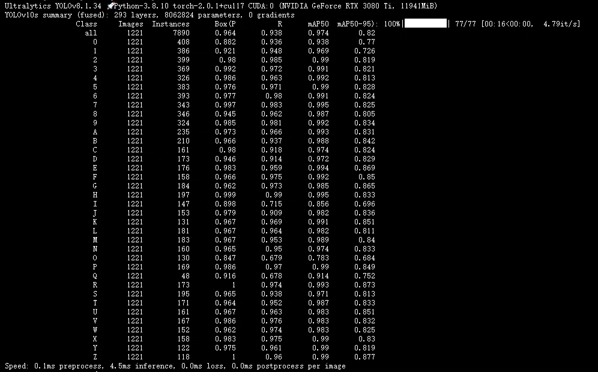
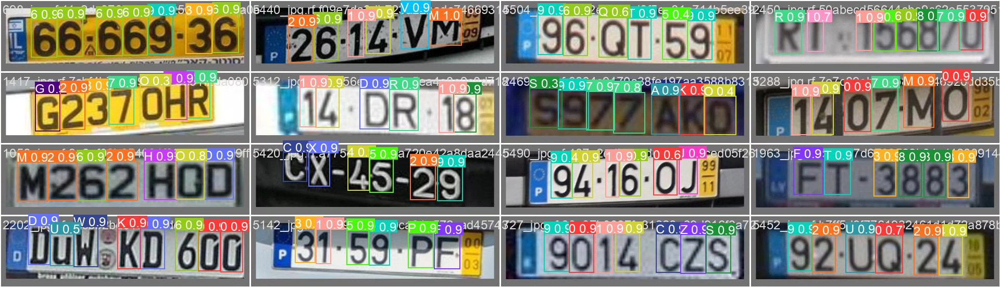
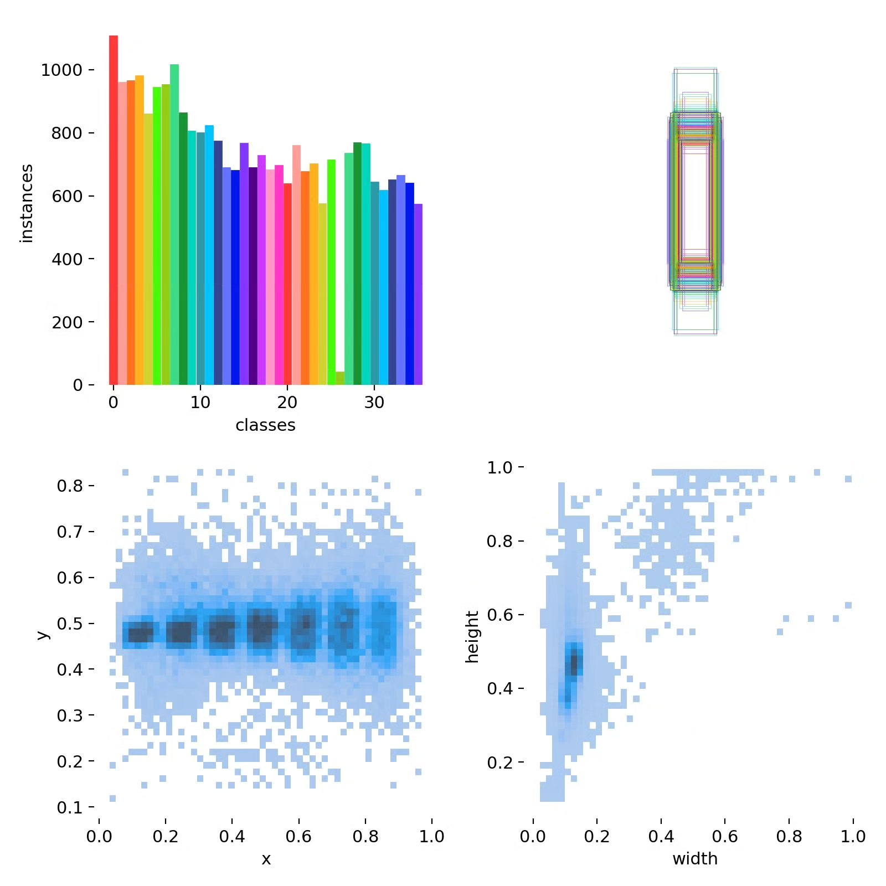

# Based on deep learning YOLOv10 for letter and number recognition detection system (YOLOv

## Body

This project is based on the latest YOLOv10 object detection framework, developing a high-performance letter and number recognition system that can detect and recognize 36 types of letters and numbers in images (0-9 digits and A-Z uppercase letters). The system achieves precise positioning and classification of various characters under complex scenarios through advanced deep learning algorithms, providing reliable character recognition solutions for automation recognition, industrial inspection, intelligent transportation, and other application scenarios. The project uses a professional dataset containing 6,076 high-quality labeled images, including 4,245 training sets, 1,221 validation sets, and 610 test sets. Through scientific data segmentation and enhancement strategies, the model is equipped with strong generalization capabilities. The system maintains excellent performance even in challenging scenarios such as variable character sizes, complex backgrounds, and varying lighting conditions, and can be widely applied in multiple industrial fields, such as license plate recognition, product serial number detection, and logistics sorting.

The company's products have obtained YOLO official commercial license certification.

We provide after-sales service.

After payment, we will provide WeChat ID to answer questions at any time.

Environment configuration: We will provide an environment configuration tutorial, and WeChat will provide答疑.

Remote installation service: If you need remote configuration, an additional fee of 69 is required.
If the configuration fails, all fees are refundable (only refund installation fees for special old computers).

Retraining dataset: After setting up the environment, you can train on your own computer.
If you need us to retrain, just pay 69 + computing power fees (2.5 yuan/hour)

## Images

## Payment

Here is a pay link on Stripe ( https://buy.stripe.com/3cs8yP7sY87d0vu9AB ). Please contact me lonlonago@foxmail.com after funding $89, and I will send you a complete data files , thank you!

